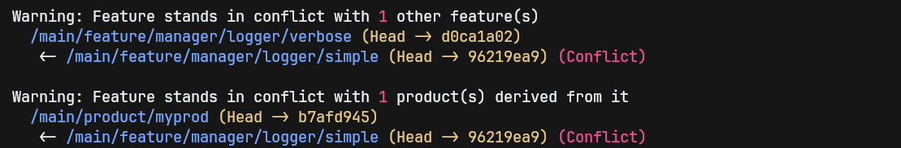
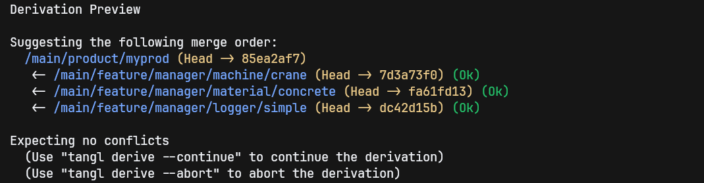
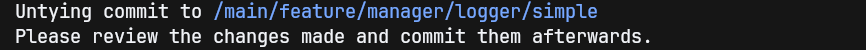

# tangl

Welcome to **tangl**, a tool to manage git repositories as feature models!

## How To Use

### The Basics

Git is a ***version control system*** (VCS) and is therefore great in managing consequitive versions of your project.
This is also known as ***variability in time***.

You also may have multiple ***variants*** of the same artifact next to each other.
For example, a specific module adapted for different OSs/hardware. 
This is called ***variability in space*** and is usually organized as so-called ***feature models***.

Git can model parallel variants with its branches, but traditionally, they are meant to be merged into main, sooner or later.
This forcibly entangles artifacts that you might want to have separated by default, and only assemble as needed.

Git does not remember the parent-child relationships between branches, so using git-native commands to manage a feature model is very combersome.
This is where **tangl** comes into play: it introduces a naming convention for branches, and parses them internally to recognize those relationships!

### The Repository Tree

**tangl** introduces a number of types each node in this tree may possess.

```
main [area]
├── feature [feature root]
│   └── manager [feature]
│       ├── logger [feature]
│       │   ├── simple [feature]
│       │   └── verbose [feature]
│       ├── machine <- abstract, no branch
│       │   ├── crane [feature]
│       │   └── excavator [feature]
│       └── material <- abstract, no branch
│           ├── concrete [feature]
│           └── earth [feature]
└── product [product root]
    └── myprod [product]
```

- **Area**: the top most branch, used to organize the remaining structure underneath it.
    The first one is usually ``main`` or ``master``, but additional ones like ``develop`` are possible.
- **Feature Root**: All feature branches are organized under this node.
- **Product Root**: All product branches are organized under this node.
- **Feature**: Individual artifacts are stored on feature branches.
    Nodes that do not have a branch are abstract and used for categorizing complex subtrees.
- **Product**: Assembled products have their own branch.
    Similar to features, nodes without branches can be used for categorizing.

### Mechanics

#### Navigating the Tree

As opposed to native git, where each branch stands alone, navigating the tree works like the ``cd`` command on the shell.
You can checkout children of the current branch by using the child's name alone. You do not need to type the entire path.

All ***areas*** have the common root ``/``.
You can prefix paths with ``/`` to make them absolute.
The relative identifiers ``.`` and ``..`` are also possible.
For example:

```bash
# When on main:
# These navigate to /main/feature/foo
tangl checkout feature/foo
tangl checkout /main/feature/foo

# When on /main/feature/foo:
# These navigate to /main
tangl checkout ../..
tangl checkout /main
```
This convention is not limited to checkout.
It applied throughout all commands.

#### Consistency Preservation

**tangl** attempts to preserve consistency between features and products using merge-tests and commit/patch comparison.
Merge-tests can be executed manually via the ``tangl test`` command, which test-merges branches to discover conflicts.
These checks are executed automatically as part of some other operations.

#### Developing Features

Feature development works similar to git.
You checkout a feature branch, make modifications, and commit to it.
You can add and remove features via the ``tangl feature`` command.

If you commit on a feature, this feature is test-merged against all others and its products, so you are notified if you introduced conflicts.

Typical workflows involving branches like ``develop`` or ``release`` are possible in theory.
Currently, there is no explicit support, but we plan to use ***areas*** for that.

Example:
```bash
tangl checkout /main/feature/logger/simple # checkout simple logger
## change something that conflicts with product and verbose ##
tangl add .
tangl commit -m "change with conflict"
```
<p>
  
</p>

#### Deriving Products

To assemble a product out of features, you first create a product via the ``tangl product`` command.
After checkout, you run the ``tangl derive`` command and pass the features you like.
If you use bash, the command suggests features via auto-completion for you.

Product derivation is a staged process.
**tangl** performs test-merges of all participating features at the start, so you get a preview of how many conflicts you can expect.
When passing the ``-o/--optimize`` flag, it will attempt to optimize the merge order to move conflicts at the end of the chain.
This reduces follow-up conflicts and can recognize if fixes are already present on the product or a feature.

Example:
```bash
tangl checkout /main # checkout main to create product
tangl product myprod # create product
tangl checkout product/myprod # checkout product
tangl derive manager/machine/crane manager/material/concrete manager/logger/simple --optimize
```
<p>
  
</p>

#### Updating Products

If feature development progresses past a product, you might want to update it.
Repeating the derivation command that generated this product issues an update operation.
Alternatively, you can use ``tangl derive --update``.
Either way, a new derivation process will be initiated.

#### *Untying*: Moving Change from Product to Feature

Commiting to a product branch allows you to do final adjustments or to fix bugs, for example.
If these changes are important enough to be part of a feature, so other products can profit from them as well, you can use ``tangl untie``.
This operation uses ``git cherry-pick`` to copy the chosen commit onto another feature.

Example:
```bash
tangl checkout /main/product/myprod # checkout product
## change something ##
tangl untie HEAD /main/feature/manager/logger/simple # copy commit to simple logger
tangl commit -m "copied from product"
```
<p>
  
</p>

## Getting Started

### Running the Example in Docker
We provide the toy example of the sections above inside a docker container, so you don't need to install anything on your system to try it out.

**Requirements**
- docker compose
- docker buildx
- make
- Python (to run the example code)

In the repository's root, run
```bash
make example
```
This builds and spins up a docker container, containing the ``tangl`` binary and command, bash completion, and the example repository.

The container will expose the example repository under ``target/example`` in this repository's root.
You can use any editor/IDE to make modifications and use the container to run ``tangl`` commands.

The example is written in Python, just use your local interpreter and execute the main.py.
There are no dependencies.

### Local Build, Installation and Development

**Requirements:**
- Latest version of Rust and Cargo 1.x
- bash for dynamic completion
- ``~/.cargo/bin`` on your ``PATH``
- make
- llvm-cov (Only for test coverage)

#### Build + Installation
```bash
make
```
This builds the binary and installs it under ``~/.cargo/bin``.
This also copies a script for bash completion into ``~/.local/share/bash-completion/completions``.

Verify your installation by running ``tangl``.
This should print the help.

#### Development Environment

We suggest using an IDE like VSCode or RustRover.
They handle everything for you.

#### Running Tests

```bash
make test
```
This runs all tests and provides a coverage report.